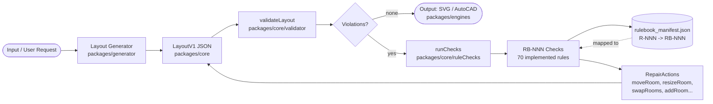
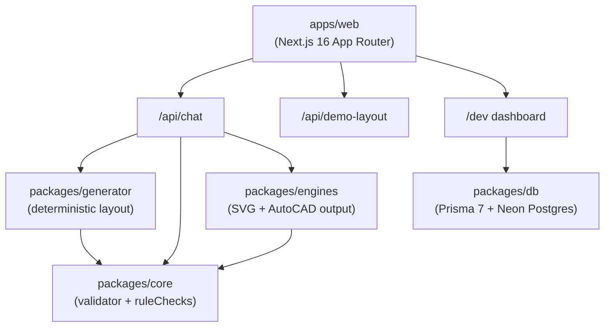
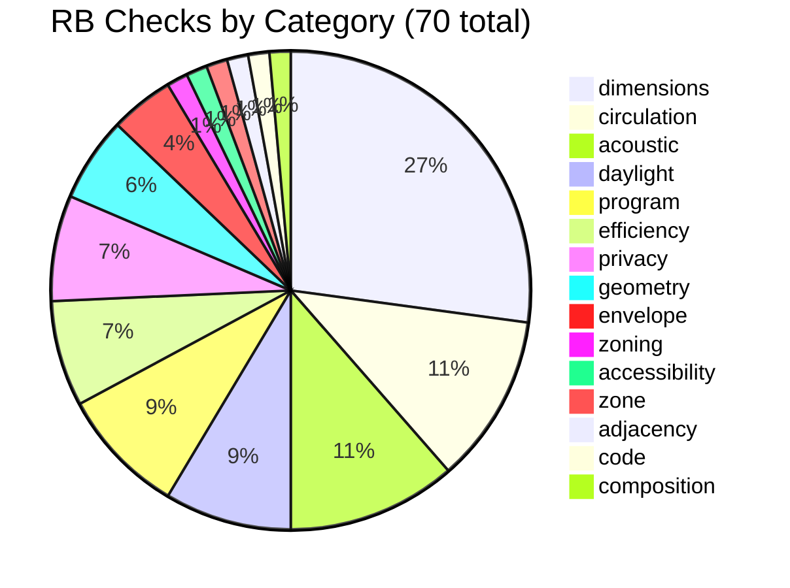
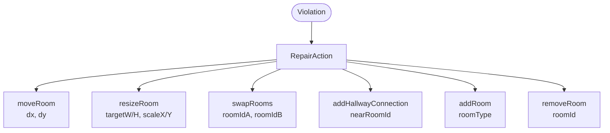

# ArchiVox System Map

> Auto-generated by `scripts/generate_system_map.py` from `rulebook_manifest.json`.
> Schema: `rulebook-manifest.v2` | Extracted rules: 145 | Implemented checks: 70


## 1. ArchiVox Pipeline



## 2. Package Dependency Graph



## 3. Rulebook Check Coverage by Category



## 4. Confidence Breakdown

```
  Total implemented checks: 70

  ** high     [##############--------------------------]  25 / 70 (36%)
  *  medium   [####################--------------------]  36 / 70 (51%)
  ~  low      [#####-----------------------------------]   9 / 70 (13%)
```

## 5. RB Checks by Category

| Category | Count | High | Medium | Low | Example Check |
|----------|-------|------|--------|-----|---------------|
| accessibility | 1 | 0 | 1 | 0 | Bathroom Circulation Access |
| acoustic | 8 | 3 | 5 | 0 | Laundry Not Adjacent Bedroom |
| adjacency | 1 | 0 | 1 | 0 | Primary Bedroom Adjacent Bathroom |
| circulation | 8 | 6 | 2 | 0 | Circulation Connectivity |
| code | 1 | 1 | 0 | 0 | Hall Minimum Width |
| composition | 1 | 0 | 1 | 0 | Max Single Room Area Dominance |
| daylight | 6 | 4 | 2 | 0 | Living Room Exterior Access |
| dimensions | 19 | 5 | 12 | 2 | Bedroom Minimum Area |
| efficiency | 5 | 1 | 4 | 0 | Excessive Circulation Area |
| envelope | 3 | 2 | 1 | 0 | Entry Exterior Access |
| geometry | 4 | 1 | 2 | 1 | No Thin Slivers |
| privacy | 5 | 2 | 3 | 0 | Bedroom Not Adjacent to Entry |
| program | 6 | 0 | 1 | 5 | Closet Near Bedroom |
| zone | 1 | 0 | 1 | 0 | Kitchen-Dining Adjacency |
| zoning | 1 | 0 | 0 | 1 | Garage Area Ratio Max |

## 6. Rule Check Network (category clusters)

```mermaid
graph LR
    VALIDATOR([validator.ts]) --> CHECKS([runChecks])
    CHECKS --> ACCESSIBILITY{{ accessibility }}
    ACCESSIBILITY --> RB_RB_018["RB-018 *<br/>Bathroom Circulation Access"]
    CHECKS --> ACOUSTIC{{ acoustic }}
    ACOUSTIC --> RB_RB_010["RB-010 *<br/>Laundry Not Adjacent Bedroom"]
    ACOUSTIC --> RB_RB_013["RB-013 *<br/>Bedroom Not Adjacent Kitchen"]
    ACOUSTIC --> RB_RB_021["RB-021 *<br/>Bathroom Not Adjacent Dining"]
    ACOUSTIC --> RB_RB_022["RB-022 *<br/>Bathroom Not Adjacent Garage"]
    CHECKS --> ADJACENCY{{ adjacency }}
    ADJACENCY --> RB_RB_064["RB-064 *<br/>Primary Bedroom Adjacent Bat"]
    CHECKS --> CIRCULATION{{ circulation }}
    CIRCULATION --> RB_RB_007["RB-007 **<br/>Circulation Connectivity"]
    CIRCULATION --> RB_RB_012["RB-012 **<br/>Entry to Public Space"]
    CIRCULATION --> RB_RB_024["RB-024 **<br/>Living Room Near Entry"]
    CIRCULATION --> RB_RB_030["RB-030 *<br/>Hall Needed for Large Plans"]
    CHECKS --> CODE{{ code }}
    CODE --> RB_RB_066["RB-066 **<br/>Hall Minimum Width"]
    CHECKS --> COMPOSITION{{ composition }}
    COMPOSITION --> RB_RB_070["RB-070 *<br/>Max Single Room Area Dominan"]
    CHECKS --> DAYLIGHT{{ daylight }}
    DAYLIGHT --> RB_RB_004["RB-004 **<br/>Living Room Exterior Access"]
    DAYLIGHT --> RB_RB_005["RB-005 *<br/>Kitchen Exterior Access"]
    DAYLIGHT --> RB_RB_011["RB-011 **<br/>Bedroom Exterior Access"]
    DAYLIGHT --> RB_RB_027["RB-027 **<br/>Office Exterior Access"]
    CHECKS --> DIMENSIONS{{ dimensions }}
    DIMENSIONS --> RB_RB_002["RB-002 ~<br/>Bedroom Minimum Area"]
    DIMENSIONS --> RB_RB_019["RB-019 *<br/>Kitchen Minimum Area"]
    DIMENSIONS --> RB_RB_029["RB-029 *<br/>Bathroom Minimum Area"]
    DIMENSIONS --> RB_RB_046["RB-046 *<br/>Living Room Minimum Area"]
    CHECKS --> EFFICIENCY{{ efficiency }}
    EFFICIENCY --> RB_RB_015["RB-015 *<br/>Excessive Circulation Area"]
    EFFICIENCY --> RB_RB_026["RB-026 *<br/>Laundry in Service Zone"]
    EFFICIENCY --> RB_RB_035["RB-035 **<br/>Kitchen?Pantry Adjacency"]
    EFFICIENCY --> RB_RB_036["RB-036 *<br/>Wet Core Dispersal"]
    CHECKS --> ENVELOPE{{ envelope }}
    ENVELOPE --> RB_RB_016["RB-016 **<br/>Entry Exterior Access"]
    ENVELOPE --> RB_RB_048["RB-048 **<br/>Garage Exterior Access"]
    ENVELOPE --> RB_RB_057["RB-057 *<br/>Laundry Exterior Access"]
    CHECKS --> GEOMETRY{{ geometry }}
    GEOMETRY --> RB_RB_003["RB-003 ~<br/>No Thin Slivers"]
    GEOMETRY --> RB_RB_031["RB-031 *<br/>Near-Containment Tolerance"]
    GEOMETRY --> RB_RB_032["RB-032 **<br/>Total Overlap Budget"]
    GEOMETRY --> RB_RB_063["RB-063 *<br/>Kitchen Maximum Aspect Ratio"]
    CHECKS --> PRIVACY{{ privacy }}
    PRIVACY --> RB_RB_020["RB-020 **<br/>Bedroom Not Adjacent to Entr"]
    PRIVACY --> RB_RB_023["RB-023 *<br/>Bedroom Cluster"]
    PRIVACY --> RB_RB_037["RB-037 *<br/>Bedroom Pass-Through"]
    PRIVACY --> RB_RB_038["RB-038 *<br/>Bathroom Pass-Through"]
    CHECKS --> PROGRAM{{ program }}
    PROGRAM --> RB_RB_006["RB-006 ~<br/>Closet Near Bedroom"]
    PROGRAM --> RB_RB_008["RB-008 ~<br/>Bedroom Count Minimum"]
    PROGRAM --> RB_RB_009["RB-009 ~<br/>Bathroom Count Minimum"]
    PROGRAM --> RB_RB_014["RB-014 ~<br/>Bath?Bedroom Ratio"]
    CHECKS --> ZONE{{ zone }}
    ZONE --> RB_RB_055["RB-055 *<br/>Kitchen-Dining Adjacency"]
    CHECKS --> ZONING{{ zoning }}
    ZONING --> RB_RB_001["RB-001 ~<br/>Garage Area Ratio Max"]
```



## 7. RepairAction Types


